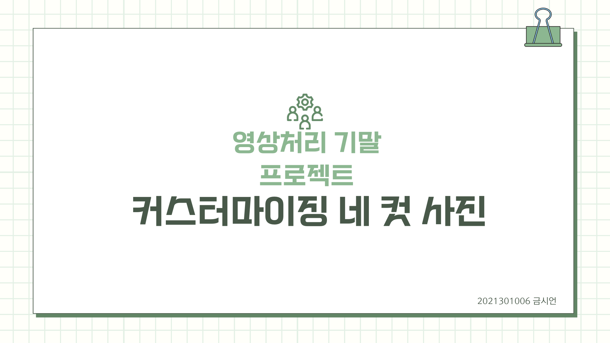
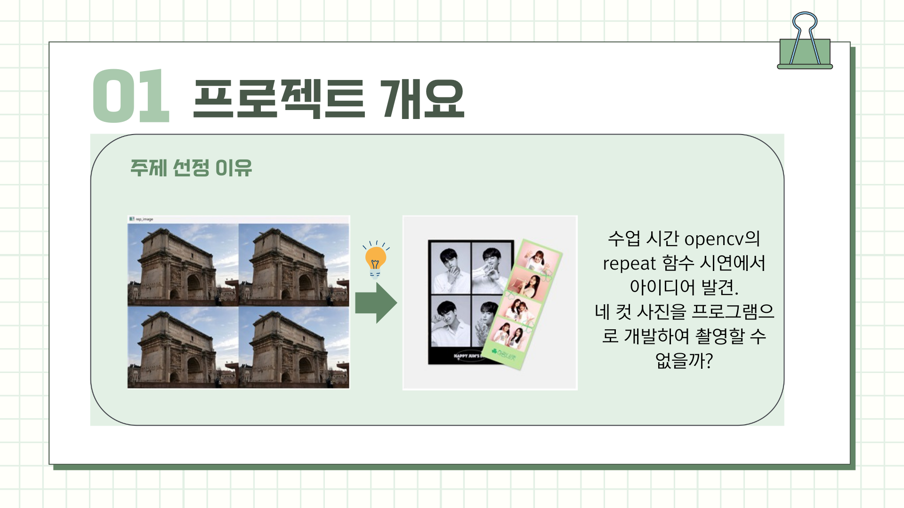
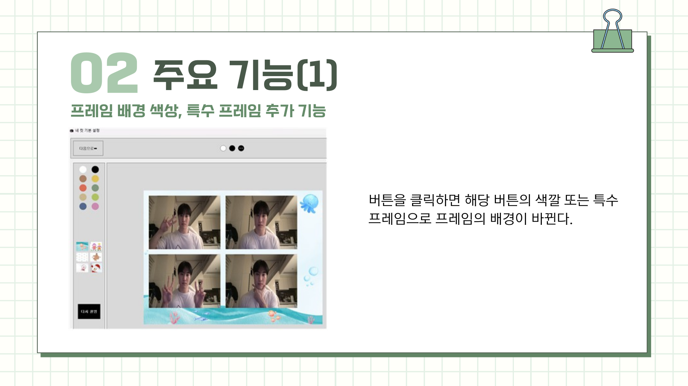
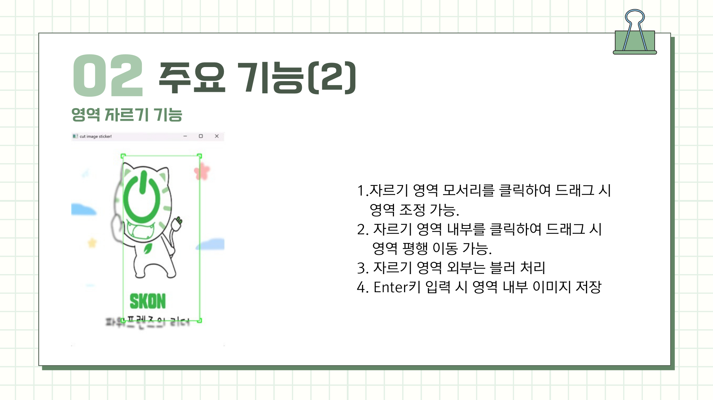
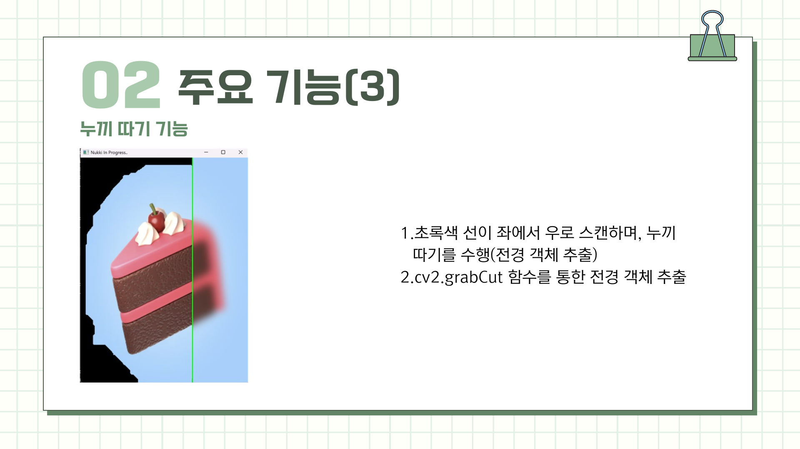
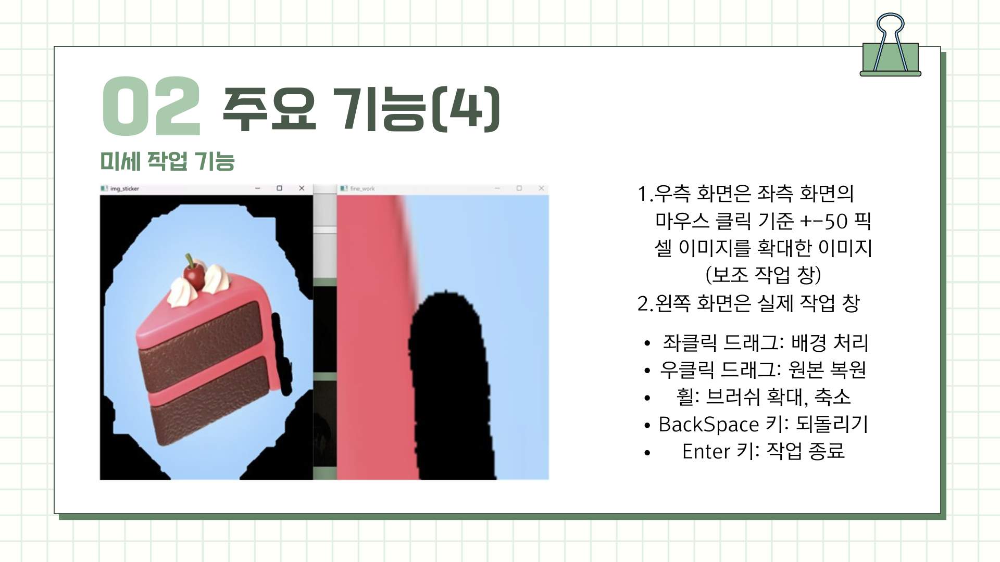
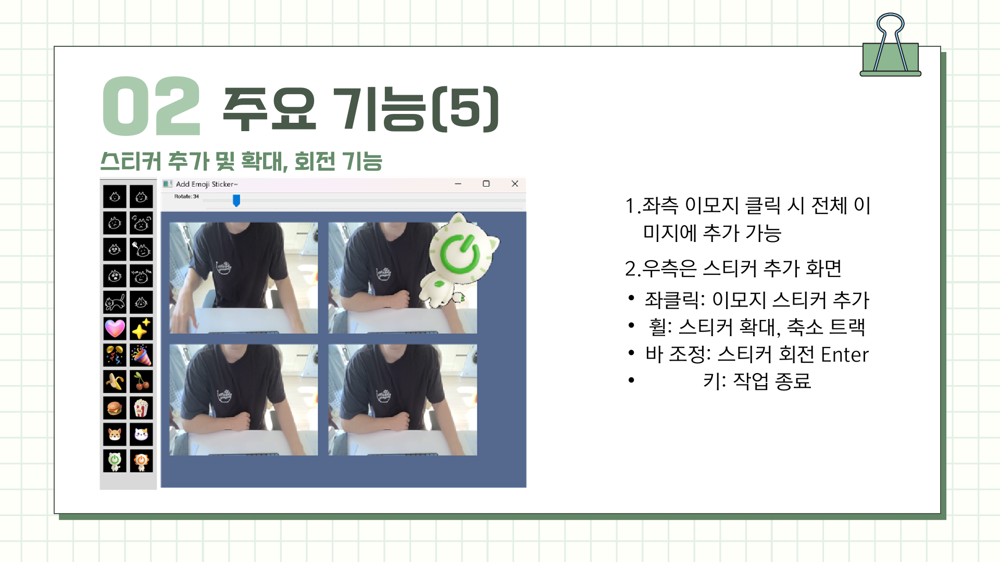
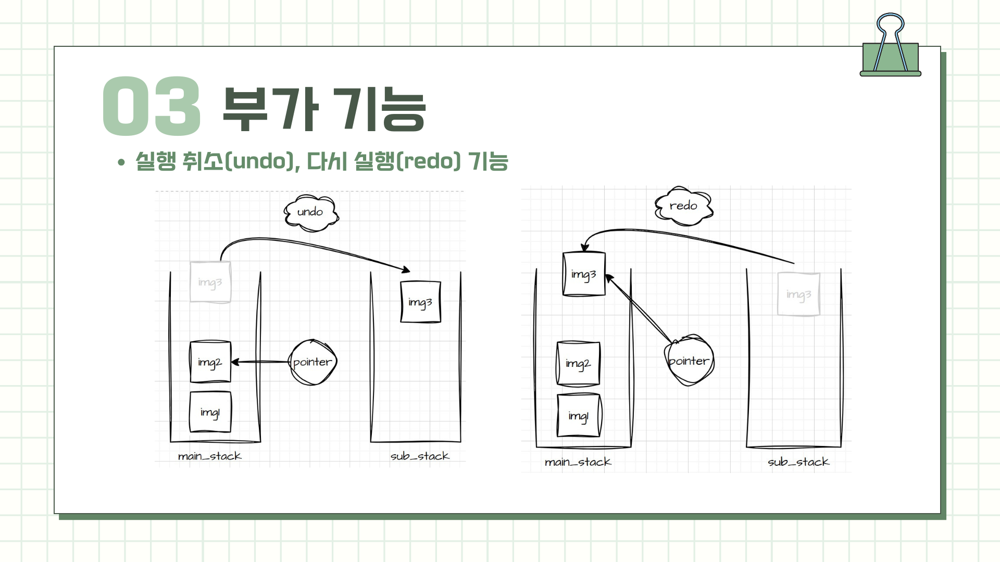
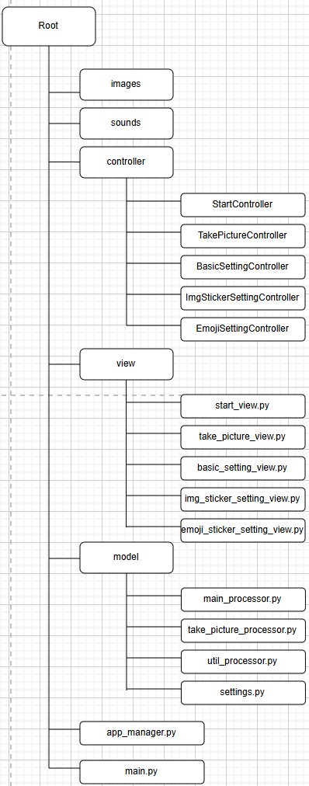
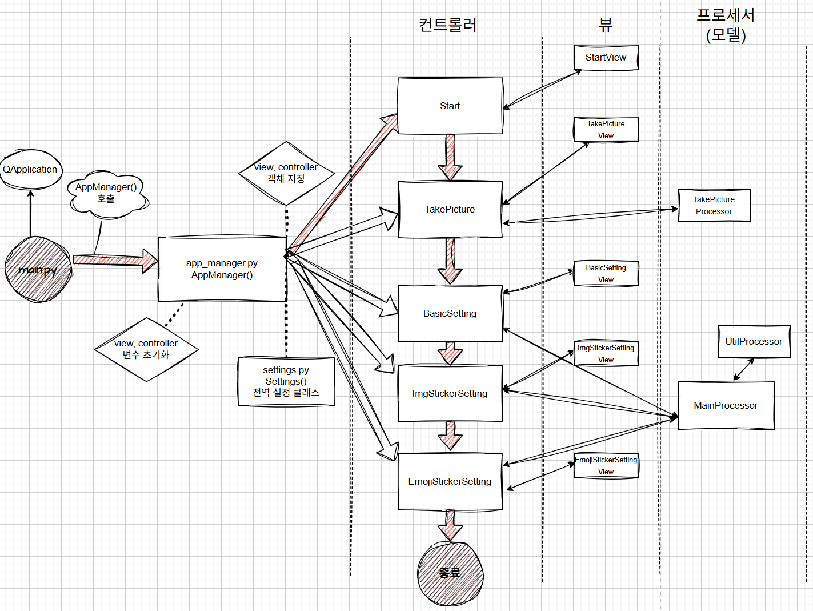

<<<<<<< HEAD
- 🏫 대학교 기말 프로젝트: OpenCV 라이브러리를 활용한 콜라주 프로그램
- 📅 진행 기간: 2025.11.17 ~ 2025.12.02

---

## 👨 구성원

| Name   | GitHub                                   |
| ------ | ---------------------------------------- |
| 금시언 | [@sieon](https://github.com/silversieon) |

---

# 📝 프로젝트 개요
=======
## 📝 프로젝트 개요
>>>>>>> 013a77570d0dcb89e8b16dd12d1a8d5e37ec3f8c

<<<<<<< HEAD
---

# ⚙️ 주요 기능
=======
## ⚙️ 주요 기능
>>>>>>> 013a77570d0dcb89e8b16dd12d1a8d5e37ec3f8c

<<<<<<< HEAD
---

## ➕ 부가 기능

---

# 📁 프로젝트 파일 구조

---

# 🚩 프로그램 플로우
=======
### ➕ 부가 기능

## 📁 프로젝트 파일 구조

## 🚩 프로그램 플로우
>>>>>>> 013a77570d0dcb89e8b16dd12d1a8d5e37ec3f8c

---
